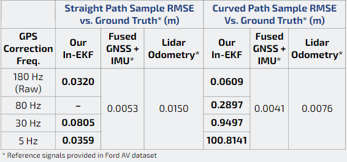

# DRIFT In-EKF GPS Correction Frequency Analysis using Ford AV Dataset

Hey everyone, welcome to our project! This is built off of the CURLY DRIFT library, please refer to their wonderful and extremely thorough installation and build instructions below.

## Project Abstract

In the automotive industry, Inertial Measurement Units (IMU) and Global Positioning System (GPS) sensors are frequently used to obtain vehicle state data. It is common practice to increase sensor accuracy and sensor message frequency to improve algorithm accuracy; however, this usually comes at the expense of a more expensive sensor. This paper aims to investigate the impact of decreasing GPS frequency on an Invariant Kalman filter implementation, in order to comprehend a potential lower bound on GPS sensor update rate with respect to accumulated error. 

All project materials can be found in the following folder: https://drive.google.com/file/d/1bfKoXbWuWJHtk1LLLd8McSnwwiFw3PpV/view?usp=drive_link

## DRIFT Description

Dead Reckoning In Field Time (DRIFT) is an open-source C++ software library designed to provide accurate and high-frequency proprioceptive state estimation for a variety of mobile robot architectures. By default, DRIFT supports legged robots, differential-drive wheeled robots, full-size vehicles with shaft encoders and marine robots with a Doppler Velocity Log (DVL). Leveraging symmetry-preserving filters such as [Invariant Kalman Filtering (InEKF)](https://www.annualreviews.org/doi/10.1146/annurev-control-060117-105010), this modular library empowers roboticists and engineers with a robust and adaptable tool to estimate instantaneous local pose and velocity in diverse environments. The software is structured in a modular fashion, allowing users to define their own sensor types, and propagation and correction methods, offering a high degree of customization.

Detailed documentations and tutorials can be found at [https://umich-curly.github.io/DRIFT_Website/](https://umich-curly.github.io/DRIFT_Website/).

## Framework for Ford AV Example (IMU Propagation + GPS Correction)


## Downsampling Analysis Results
We tested our filter implementation on a several GPS frequencies and driving scenarios. The datasets come from the [Ford AV]https://github.com/Ford/AVData dataset. More information on these samples were obtained can be seen in the data [README](https://github.com/abcarr/eecs568-drift-FordAV/blob/develop/data/README.txt)



# Dependencies
We have tested the library in **Ubuntu 20.04** and **22.04**, but it should be easy to compile in other platforms.

> ### C++17 Compiler
We use the threading functionalities of C++17.

> ### Eigen3
Required by header files. Download and install instructions can be found at: http://eigen.tuxfamily.org. **Requires at least 3.1.0**.

> ### Yaml-cpp
Required by header files. Download and install instructions can be found at: https://github.com/jbeder/yaml-cpp.

> ### evo
Required for trajectory visualization and error calculation. Download and install instructions can be found at: https://github.com/MichaelGrupp/evo

> ### ROS1 (Optional)
Building with ROS1 is optional. Instructions are [found below](https://github.com/UMich-CURLY/drift/tree/main#4-ros).

# Building DRIFT library

Clone the repository:
```
git clone https://github.com/abcarr/eecs568-drift-FordAV.git
```
Create another directory which we will name 'build' and use cmake and make to compile an build project:

```
mkdir build
cd build
cmake ..
make -j4
```

## Install the library
After building the library, you can install the library to the system. This will allow other projects to find the library without needing to specify the path to the library. 

```
sudo make install
```
Then, you can include the library in your project by adding the following line to your CMakeLists.txt file:
```
find_package(drift REQUIRED)
```

# ROS
## Examples
We provide several examples in the `ROS/examples` directory. 

## Building the ROS1 node
1. Add `/ROS/drift` to the `ROS_PACKAGE_PATH` environment variable. Open your ~/.bashrc file in a text editor and add the following line to the end. Replace PATH/TO with the directory path to where you cloned drift:

  ```
  export ROS_PACKAGE_PATH=${ROS_PACKAGE_PATH}:PATH/TO/eecs568-drift-FordAV/ROS/drift
  ```

  Then
  ```
  source ~/.bashrc
  ```
  
2. Execute `build_ros.sh` script in the repository root directory:

  ```
  cd eecs568-drift-FordAV
  chmod +x build_ros.sh
  ./build_ros.sh
  ```

## Ford AV example

1) start roscore
```
roscore
```

2) in another terminal start ford_av node
```
rosrun drift ford_av
```

3) in another terminal start rosbag
```
rosbag play data/FordAV_straight_path_data_sample.bag --pause
```

4) in another terminal start gps throttling (Use 180 Hz as default)
```
rosrun topic_tools throttle messages gps <desired frequency>
```

5) in another terminal (visualize the pose). Return to terminal with rosbag and press spacebar to "play" demo
```
rostopic echo /ford_av/vanila_inekf/pose
```

If you are interested in recording your own bag file for analysis...
```
rosbag record -a -O example_bagname
```

To visualize trajectories/error metrics, we used the evo library (linked above). Some example commands # are below, but please refer to the library documentation for more information. Note that /pose_raw refers to the fused GNSS + IMU solution and /pose_localized refers to the Lidar Odometry solution. For more information please refer to the Ford AV dataset documentation

```
evo_traj bag example_bagname.bag /pose_raw /pose_localized /ford_av/vanila_inekf/pose --ref=/pose_ground_truth --plot
```

# License
DRIFT is released under a [BSD 3-Clause License](https://github.com/UMich-CURLY/drift/blob/main/LICENSE). 